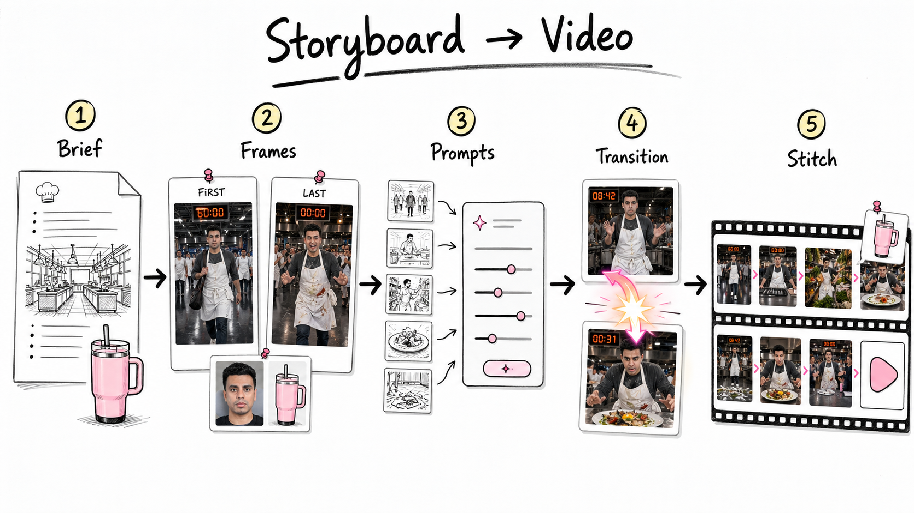

# AI Storyboard Video Starter

Make longer AI videos by building them like a director: one short controlled shot at a time.

Instead of asking an AI video model for one long video, you:

1. Write a simple creative brief.
2. Collect references.
3. Break the video into short shots.
4. Generate the first and last frame of each shot.
5. Generate video between those locked frames.
6. Stitch the clips together.

That is the whole method.



## Who This Is For

This repo is for total beginners who want a repeatable folder system for AI video projects.

Use it for:

- Product videos
- SaaS videos
- Character/story videos
- Fun cinematic videos
- Ads, demos, launches, tutorials, reels

You do not need to understand filmmaking. The repo tells you what to do next.

## Start Here

### Fastest Setup In Claude Code

Paste this repo URL into Claude Code and say:

```text
Set up this repo for an absolute beginner. Run the beginner environment setup, open the demo in Finder, show me where the images/videos/prompts are, then create a blank project and help me start the creative brief.
```

Claude Code should run:

```bash
tools/setup-environment.sh --open
```

That creates:

```text
projects/demo-walkthrough/    a finished clickable example with real images and videos
projects/my-first-video/      a blank project for your own video
```

Open this guide after setup:

```text
projects/START_HERE_AFTER_SETUP.md
```

More detail: [docs/claude-code-newbie-setup.md](docs/claude-code-newbie-setup.md)

### Option A: Use The Example First

Open:

[examples/masterchef-pink-cup](examples/masterchef-pink-cup)

This is a finished example showing the whole flow:

- Creative brief
- References
- Image prompts
- Approved storyboard frames
- Video prompts
- Transition clips
- Stitching notes
- Final output

If you are new, look through this example before making your own project.

To copy the finished example into `projects/` for a workshop walkthrough, run:

```bash
tools/setup-demo.sh demo-walkthrough --open
```

### Option B: Create Your Own Project

Run:

```bash
tools/create-project.sh my-first-video
```

Then open:

```text
projects/my-first-video/
```

If you do not want to use the terminal, copy the folder:

```text
templates/project-template/
```

Then rename the copy to your project name.

### Option C: Save Progress To GitHub

After Claude Code generates useful files, ask:

```text
Commit and push this project progress to GitHub.
```

Claude Code can run:

```bash
tools/save-to-github.sh "Save storyboard project progress"
```

## The One Rule

Every step has three folders:

```text
attempts/      rough drafts go here
approved/      locked files go here
disapproved/   rejected files go here
```

Only build the next step from files in `approved/`.

That is how you stop the project from becoming chaos.

## Copy This Into Your LLM

After you create a project folder, paste this into ChatGPT, Claude, Codex, or any LLM:

```text
I am making a storyboard-style AI video.

Use this workflow:
1. Creative brief
2. References
3. Shot list
4. Image prompts
5. Storyboard frames
6. Video prompts
7. Transition videos
8. Stitching
9. Final output

Ask me what kind of video I want:
- Product video
- SaaS video
- Character/story video
- Fun cinematic video

Then ask me for the references we need.

Before starting, ask:
Do you want approval at every step, or should I use autopilot and only stop if something is risky or unclear?

At every step:
- Put drafts in attempts/
- Put approved files in approved/
- Put rejected files in disapproved/
- Ask me to approve or revise before moving on

Start by helping me write the creative brief.
```

## The Beginner Workflow

### Step 1: Creative Brief

Open:

```text
01-creative-brief/
```

Write what the video is about.

Example:

```text
A tense cooking competition ad where Samin races against the clock.
The pink cup appears at the chef station across the sequence.
The video should feel cinematic, fast, and dramatic.
```

Put drafts here:

```text
01-creative-brief/attempts/
```

When approved, move the final brief here:

```text
01-creative-brief/approved/
```

Approval question:

```text
Does this brief match the video you want?
```

### Step 2: References

Open:

```text
02-references/
```

Add anything the model must keep consistent.

For a product video, add:

- Product photo
- Logo
- Packaging
- Brand colors

For a SaaS video, add:

- App screenshots
- Dashboard screenshots
- Logo
- Brand colors

For a story video, add:

- Character photo
- Outfit reference
- Location reference
- Important prop reference

Example from the demo:

```text
02-references/approved/samin-reference.jpg
02-references/approved/pink-support-cup.jpg
```

Approval question:

```text
Are these the references we should lock?
```

### Step 3: Shot List

Open:

```text
03-shot-list/
```

Break the video into short shots.

Simple example:

```text
Shot 01: Samin walks into the kitchen.
Shot 02: Samin gets ready at the station.
Shot 03: Samin grabs ingredients.
Shot 04: Samin finishes the dish.
Shot 05: Judges react.
```

The better version includes first and last frames:

```text
Shot 01: F1 entrance -> F2 at station
Shot 02: F2 at station -> F3 pantry
Shot 03: F3 pantry -> F4 plated dish
```

Approval question:

```text
Is this the right sequence before we write prompts?
```

### Step 4: Image Prompts

Open:

```text
04-image-prompts/
```

Write prompts for the first and last frame of every shot.

Example:

```text
Frame 01:
Wide shot of Samin entering a bright competition kitchen.
White apron, dark shirt, nervous expression.
Large digital clock reads 60:00.
Use Samin reference for identity.

Frame 02:
Samin at the chef station, hands on the counter.
Pink cup sits beside the knife roll.
Clock still reads 60:00.
```

Approval question:

```text
Are these image prompts ready to generate storyboard frames?
```

### Step 5: Storyboard Frames

Open:

```text
05-storyboard-frames/
```

Generate the actual images.

Put rough generations here:

```text
05-storyboard-frames/attempts/
```

Put the selected frames here:

```text
05-storyboard-frames/approved/frames/
```

For each video shot, create a folder with two files:

```text
05-storyboard-frames/approved/shots/shot-01/
  first-frame.png
  last-frame.png
```

Example from the demo:

```text
shot-01-walk-to-station/
  first-frame.png
  last-frame.png
```

Approval question:

```text
Do these frames look consistent enough to use as video anchors?
```

### Step 6: Video Prompts

Open:

```text
06-video-prompts/
```

Write prompts that tell the video model how to move from the first frame to the last frame.

Example:

```text
Use first-frame.png and last-frame.png as anchors.
Duration: 6 seconds.
Samin walks from the entrance to the chef station.
Camera tracks backward slowly.
Keep the same face, same kitchen, same apron, same pink cup.
End exactly on the last frame.
```

Approval question:

```text
Are these video prompts ready to run?
```

### Step 7: Transition Videos

Open:

```text
07-transition-videos/
```

Generate short clips from your approved first and last frames.

Put attempts here:

```text
07-transition-videos/attempts/
```

Put approved clips here:

```text
07-transition-videos/approved/
```

Example:

```text
shot-01-walk-to-station.mp4
shot-02-sprint-to-pantry.mp4
shot-03-flow-state.mp4
```

Approval question:

```text
Does this clip move correctly from first frame to last frame?
```

### Step 8: Stitching

Open:

```text
08-stitching/
```

Combine the approved clips.

Check:

- Does the character drift?
- Does the product drift?
- Does the location jump?
- Does the audio pop?
- Does the cut feel smooth?

If needed, use small fixes:

- Trim dead frames
- Add a tiny zoom
- Add a white flash
- Add a short crossfade
- Cut on motion blur

Example from the demo:

```text
08-stitching/approved/seam-frame-review.jpg
08-stitching/approved/stitching-notes.md
```

Approval question:

```text
Does this feel like one continuous video?
```

### Step 9: Final Output

Open:

```text
09-final-output/
```

Put your final export here.

Example:

```text
09-final-output/final-video.mp4
```

You can also copy your best final output to:

```text
final-outputs/
```

That makes finished videos easy to find.

## What A Finished Project Looks Like

```text
my-video/
  01-creative-brief/
    approved/
      brief.md
  02-references/
    approved/
      product-photo.png
      logo.png
  03-shot-list/
    approved/
      shot-list.md
  04-image-prompts/
    approved/
      frame-prompts.md
  05-storyboard-frames/
    approved/
      frames/
      shots/
  06-video-prompts/
    approved/
      shot-01.md
      shot-02.md
  07-transition-videos/
    approved/
      shot-01.mp4
      shot-02.mp4
  08-stitching/
    approved/
      seam-review.jpg
      stitching-notes.md
  09-final-output/
    final-video.mp4
```

## Mini Example: Product Video

Goal:

```text
Make a 20-second launch video for a water bottle.
```

References:

```text
Product photo
Logo
Brand color
Lifestyle mood board
```

Shot list:

```text
Shot 01: Bottle on desk -> person picks it up
Shot 02: Person walks outside -> bottle in hand
Shot 03: Close-up condensation -> logo visible
Shot 04: Final hero shot -> bottle on table
```

Continuity locks:

```text
Same bottle shape.
Same logo.
Same color.
Same condensation.
```

## Mini Example: SaaS Video

Goal:

```text
Make a 15-second product demo for a scheduling app.
```

References:

```text
Dashboard screenshot
Calendar screen
Logo
Brand colors
```

Shot list:

```text
Shot 01: Messy calendar -> clean dashboard
Shot 02: User clicks available slot -> meeting created
Shot 03: Notification appears -> happy user
```

Continuity locks:

```text
Same UI.
Same logo.
Same dashboard layout.
Same brand colors.
```

## Mini Example: Story Video

Goal:

```text
Make a cinematic cooking competition reel.
```

References:

```text
Character face
Outfit
Kitchen
Pink cup
Dish
```

Shot list:

```text
Shot 01: Entrance
Shot 02: Starting line
Shot 03: Pantry
Shot 04: Peak dish
Shot 05: Collapse
Shot 06: Comeback
Shot 07: Victory
```

Continuity locks:

```text
Same chef.
Same apron.
Same kitchen.
Same pink cup.
Same clock style.
```

## Important Beginner Tips

- Do not generate video first. Generate storyboard frames first.
- Do not approve frames that look "almost right." They will get worse in video.
- If a face, logo, product, or prop matters, use a reference image.
- Keep rejected versions. They show you what to avoid.
- Short clips are easier to control than long clips.
- The final video is the result of many small approvals.

## Helpful Files

- [Workflow](docs/workflow.md)
- [Approval Gates](docs/approval-gates.md)
- [Reference Types](docs/reference-types.md)
- [Stitching Notes](docs/stitching-notes.md)
- [Demo Deliverable Script](docs/demo-deliverable-script.md)
- [LLM Start Prompt](templates/prompt-cards/llm-start-here.md)

## Tools You Can Use

This repo is tool-agnostic.

You can use:

- GPT image models
- Nano Banana or other image generators
- Seedance, Kling, Runway, Pika, Veo, or other video generators
- Any LLM for prompt writing
- `ffmpeg` for stitching

The tool matters less than the process.

Brief -> References -> Frames -> Prompts -> Transitions -> Stitch -> Final.
